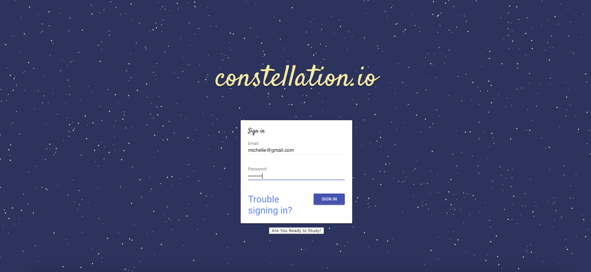
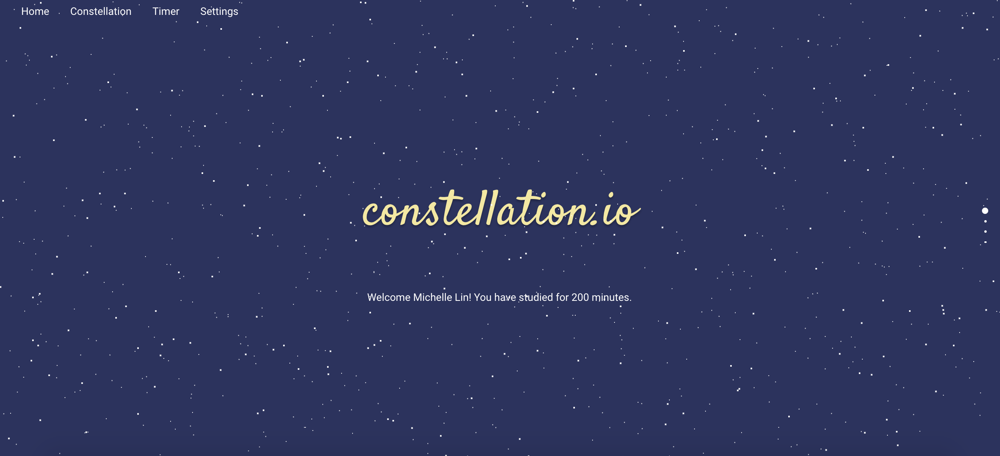
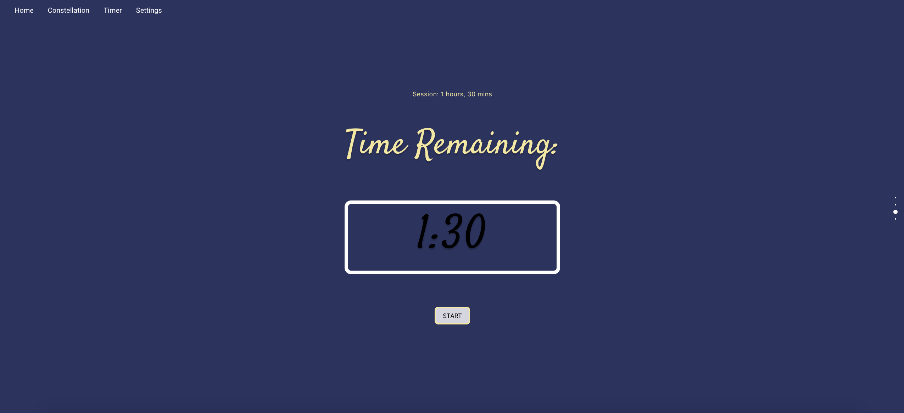
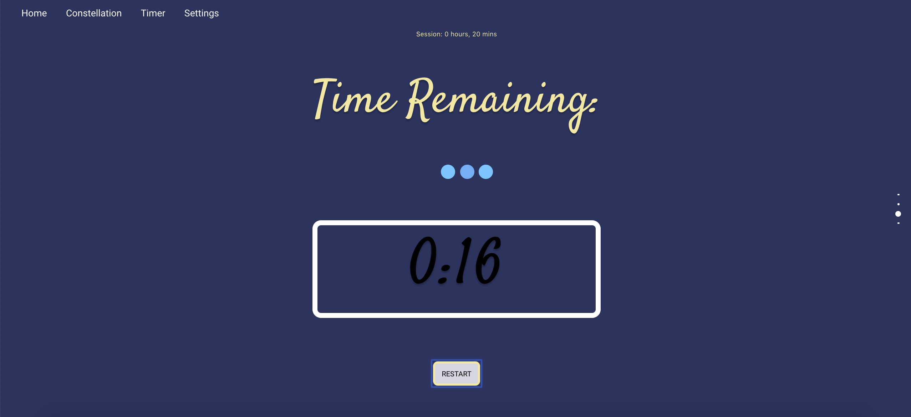
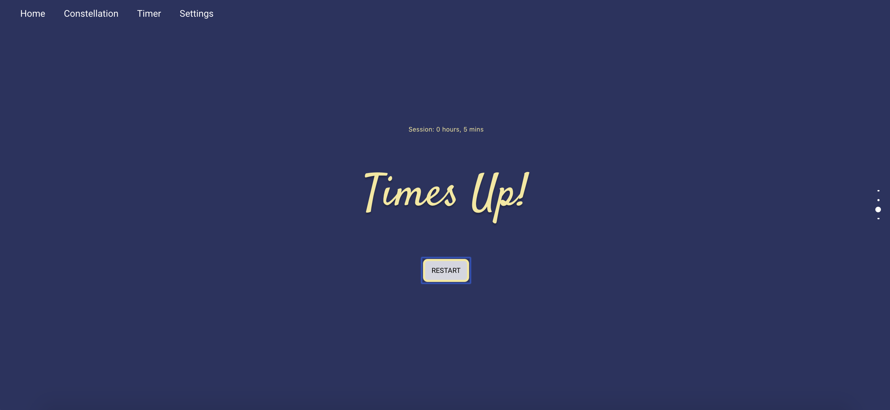

This project was bootstrapped with [Create React App](https://github.com/facebook/create-react-app).

## Available Scripts

In the project directory, you can run:

### `npm start`

Runs the app in the development mode. 
Open [http://localhost:3000](http://localhost:3000) to view it in the browser.

The page will reload if you make edits. 
You will also see any lint errors in the console.

### `npm test`

Launches the test runner in the interactive watch mode. 
See the section about [running tests](https://facebook.github.io/create-react-app/docs/running-tests) for more information.

### `npm run build`

Builds the app for production to the `build` folder. 
It correctly bundles React in production mode and optimizes the build for the best performance.

The build is minified and the filenames include the hashes. 
Your app is ready to be deployed!

See the section about [deployment](https://facebook.github.io/create-react-app/docs/deployment) for more information.

### `npm run eject`

**Note: this is a one-way operation. Once you `eject`, you can’t go back!**

If you aren’t satisfied with the build tool and configuration choices, you can `eject` at any time. This command will remove the single build dependency from your project.

Instead, it will copy all the configuration files and the transitive dependencies (webpack, Babel, ESLint, etc) right into your project so you have full control over them. All of the commands except `eject` will still work, but they will point to the copied scripts so you can tweak them. At this point you’re on your own.

You don’t have to ever use `eject`. The curated feature set is suitable for small and middle deployments, and you shouldn’t feel obligated to use this feature. However we understand that this tool wouldn’t be useful if you couldn’t customize it when you are ready for it.

## Learn More

You can learn more in the [Create React App documentation](https://facebook.github.io/create-react-app/docs/getting-started).

To learn React, check out the [React documentation](https://reactjs.org/).

### Code Splitting

This section has moved here: https://facebook.github.io/create-react-app/docs/code-splitting

### Analyzing the Bundle Size

This section has moved here: https://facebook.github.io/create-react-app/docs/analyzing-the-bundle-size

### Making a Progressive Web App

This section has moved here: https://facebook.github.io/create-react-app/docs/making-a-progressive-web-app

### Advanced Configuration

This section has moved here: https://facebook.github.io/create-react-app/docs/advanced-configuration

### Deployment

This section has moved here: https://facebook.github.io/create-react-app/docs/deployment

### `npm run build` fails to minify

This section has moved here: https://facebook.github.io/create-react-app/docs/troubleshooting#npm-run-build-fails-to-minify

## How the Extension Works

Upon running the web extension, you will prompted to sign in with your email.

Then you will be prompted for your password.  
  

Once you are logged in, go ahead an press the "Are You Ready to Study!" button.
  

The first page you will see is the home page. The entire webpage consists of 4 main components: home, rewards, timer, and settings. You can move between each component by using the navigation bar in the top left corner, scrolling through the webpage, or using the vertical slider on the right side of the page.  

#### Home Page  

  

#### Rewards Page  

  

#### Timer Page  
This is the timer page. To start a study session, go ahead and enter how many hours/minutes you want to study for.  Once you have set your timer, click submit.

  

You should now have a timer that will countdown your study session. 

  

This timer will keep track of how much time left you have of this study session. During this study session, you will not be able to access any of your blocked websites. If you need to access one of your study sessions, you can click restart and this study session will not count towards your rewards, but you will be able to access the blocked websites.  

  

At the end of your study session, the length of your study session will reflect in your rewards!  

  

#### Settings Page  

To add websites you want to block, enter the url into the form and press submit. To unblock websites, click the small x icon next to the url you want to unblock.  

  

If you try to access a blocked website during your study session, you will run into Sheldon the Clumsy Black Hole.  

  

